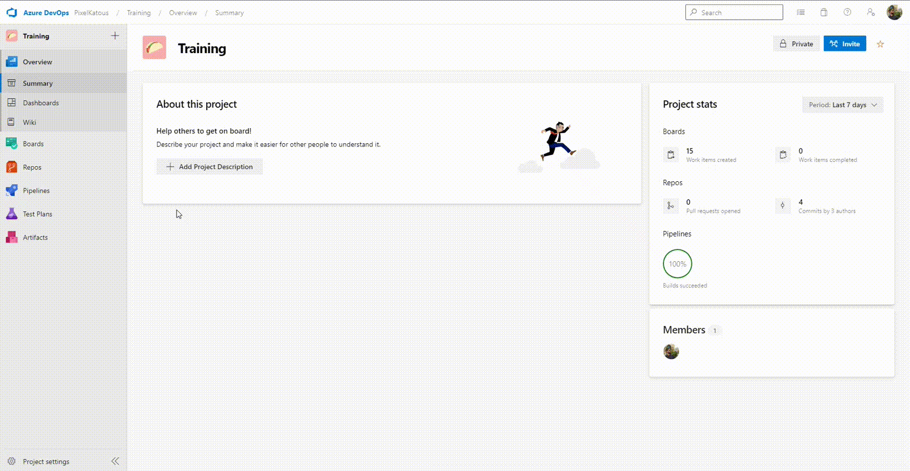
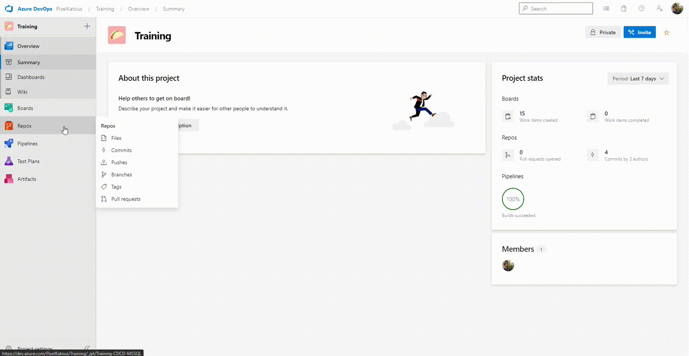
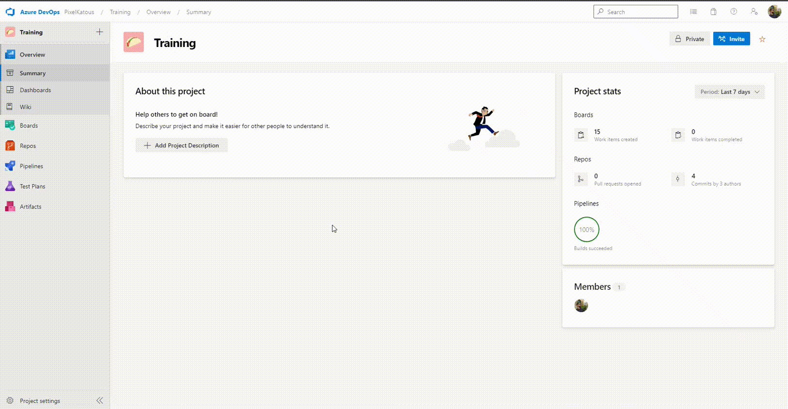
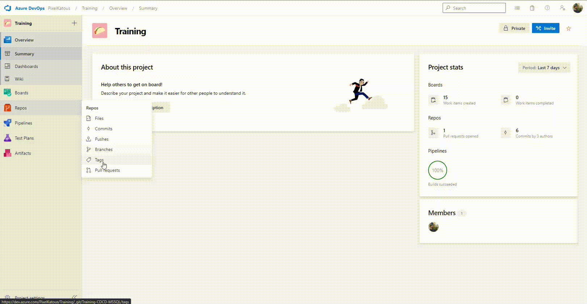
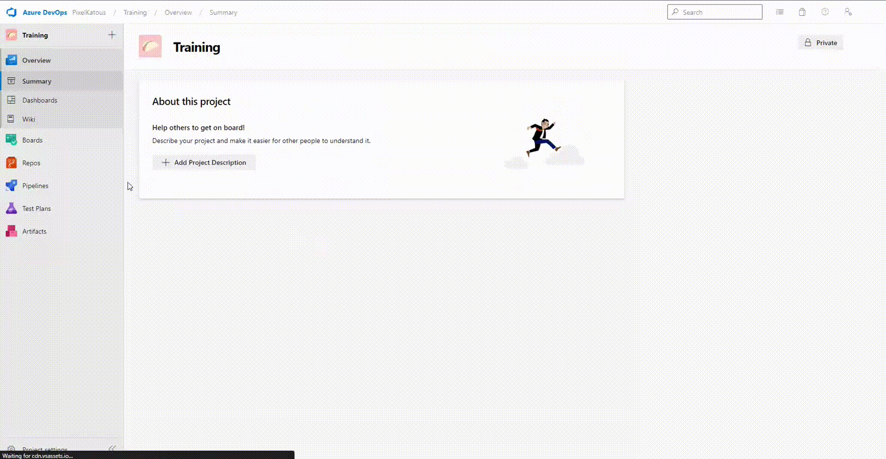

# Exercise 1: Update the database project with git

## 1. Get the work item

1. On the left menu, go to _Board_ section
2. Go go the _Sprint_ sub menu
3. Click on the assign to you work item
4. Check the description of the PBI

## 2. Create your branch

1. On the left menu, go to _repos_ section
2. Go go the _Branches_ sub menu
3. Click on _New branch_
4. Enter the name with the folowing convention : _{PBI ID}_\__{PBI NAME}_
5. Select _master_ as _Based on_ field
6. Enter your PBI ID to _Work items to link_
7. Click on create
8. Click on your branch to check the content

## 3. Develop the work item

1. On the left menu, go to _repos_ section
2. Go go the _Files_ sub menu
3. On the top select the previous created branch
4. Go to the file to update
5. Click on _Edit_ button
6. Make the update
7. Click on _Commit_ button
8. Enter your commit message
9. Click on _Commit_ button

## 4. Create a pull request

1. On the left menu, go to _repos_ section
2. Go go the _Pull Request_ sub menu
3. Click on _New pull request_
4. Select source branch
5. Select the target branch
6. Add a title (branch name + target branch)
7. Check the file _tab_ and the _commit_ tab
8. Go back to the _Overview_ tab
9. Click on _Create_ button
10. Click on _Set auto-complete_ button
11. Check _Complete associated work items after mergin_
12. Click on _Set auto-complete_

## 5. Review and validate a pull request

1. On the left menu, go to _repos_ section
2. Go go the _Pull Request_ sub menu
3. Go go the _Active_ tab
4. Click on the pull request from another trainee
5. Ensure the target branch is _develop_
6. Check the pull request name
7. Check the _Files_ tab to control the content of the update
8. Check the _Updates_ tab to control the commit messages
9. Click on _Aprove_ to validate and complete the pull request