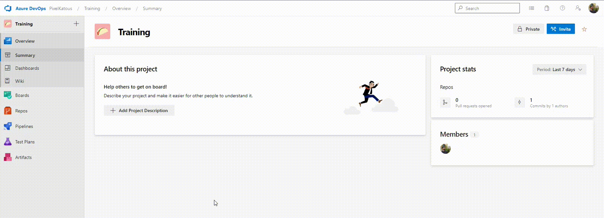
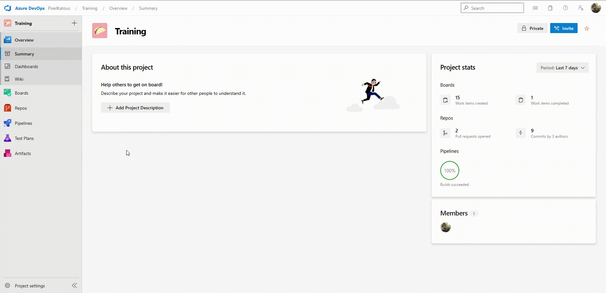

# Exercise 2: Create your first build step
The final code is available on the end of the exercise.

## 1. Create a new pipeline
Create a new yaml pipeline from teh git repository.



1. On the left menu, go to _Pipelines_ section (blue rocket icon)
2. Go go the _Pipelines_ sub menu
3. On the top rigth corner, click on _New Pipeline_
4. On _Connect_ tab, chose _Azure Repos Git_
5. Select the target repository _Training-CDCD-MSSQL_
6. Select _Starter pipeline_
7. Change the name of the yaml file by _{your trigram}_\_pipeline.yml
8. Clean the code zone 

## 2. Add pipeline triggers
In the yaml editor, add the yaml block to trigger only on "master" and "develop" branch and "AdventureWorks" folder

```yaml
trigger:
  branches:
    include:
      - master
      - develop
  paths:
    include:
      - AdventureWorks
```

## 2. Init the build stage
After the trigger block, add the yaml block to unit the first stage of the pipeline.
This stage must :
- Use the latest version of windows agent ([Image specifications](https://github.com/actions/runner-images/blob/main/images/win/Windows2022-Readme.md))
- Add folowwing variables:
  | Name               | Value                       | Comment                                      |
  | -------------------|----------------------------:| --------------------------------------------:|
  | solution           | AdventureWorks.sln          | Path to the visual studio solution           |
  | buildOutput        | AdventureWorks/bin/Release  | Path where the dacpac file will be generated |
  | buildConfiguration | Release                     | Build configuration used by visual studio    |

```yaml
stages:
  - stage: Build
    displayName: Build
    jobs:
      - job: 
        pool:
          vmImage: 'windows-latest'
        variables:
          solution: 'AdventureWorks.sln'
          buildOutput: 'AdventureWorks/bin/Release'
          buildConfiguration: 'Release'
```

## 3. Build the dacpac
In the jobs block, add 1 step with "VSBuild" type to compile the database project.
Use variables "Solution" and "buildConfiguration" defined in the preivous step.

```yaml
        steps:
        - task: VSBuild@1
          inputs:
            Solution: '$(Solution)'
            Configuration: '$(BuildConfiguration)'
```

## 4. Publish artifact
After the "VSBuild" block, add a "CopyFiles" and "PublishBuildArtifacts" blocks to publish the built dacpac file. 
```yaml
        - task: CopyFiles@2
          inputs:
            SourceFolder: '$(BuildOutput)'
            Contents: |
              *.dacpac
            TargetFolder: $(Build.ArtifactStagingDirectory)
        - task: PublishBuildArtifacts@1
          inputs:
            PathToPublish: $(Build.ArtifactStagingDirectory)
            ArtifactName: Artifacts
```

## 5. Final code
```yaml
trigger:
  branches:
    include:
      - master
      - develop
  paths:
    include:
      - AdventureWorks

stages:
  - stage: Build
    displayName: Build
    jobs:
      - job: 
        pool:
          vmImage: 'windows-latest'
        variables:
          solution: 'AdventureWorks.sln'
          buildOutput: 'AdventureWorks/bin/Release'
          buildConfiguration: 'Release'
        steps:
        - task: VSBuild@1
          inputs:
            Solution: '$(Solution)'
            Configuration: '$(BuildConfiguration)'
        - task: CopyFiles@2
          inputs:
            SourceFolder: '$(BuildOutput)'
            Contents: |
              *.dacpac
            TargetFolder: $(Build.ArtifactStagingDirectory)
        - task: PublishBuildArtifacts@1
          inputs:
            PathToPublish: $(Build.ArtifactStagingDirectory)
            ArtifactName: Artifacts
```

## 6. Execute and test the pipeline

Execute and test the pipeline to ensure the dacpac is generated


1. Click on _Save and run_
2. Enter a commit message
3. Keep _Commit directly to the master branch_
4. Click on save and run
5. Wait to the end of the build
6. When done go back
7. Click on _1 published_ to check the generated artifact

## 7. Rename the pipeline



1. On the left menu, go to _Pipelines_ section (blue rocket icon)
2. Go go the _Pipelines_ sub menu
3. Identify the created pipeline
4. Click on _..._
5. Select _Rename / Move_
6. Set _name_ with value _Training-CDCD-MSSQL-{Trigram}_
7. Set _folder_ with the current day with format _YYYY-MM-DD_
8. Go to _All_ tab thene expend the folder to find your pipeline