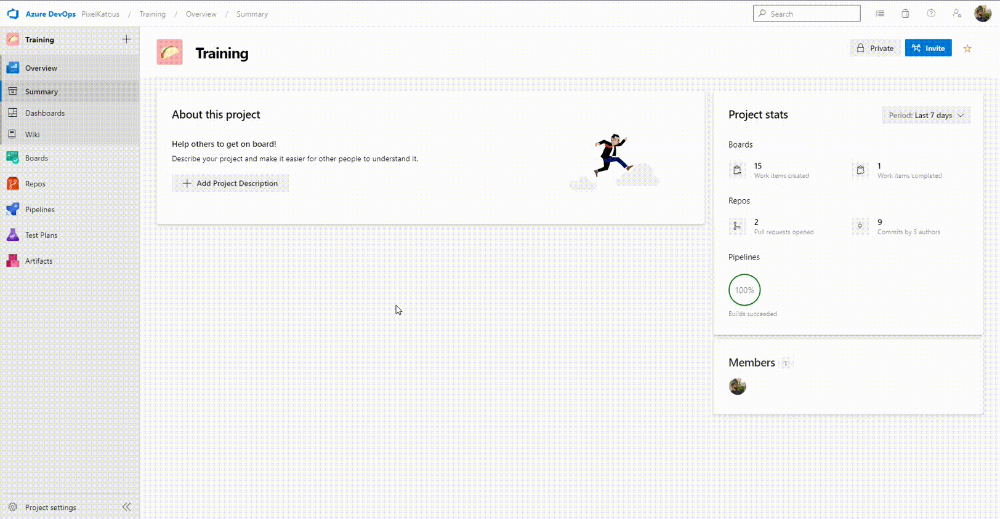

# Exercise 3: Create a variable group

## 1. Create DEV variable group
Create a new variable group liked with DEV values

1. On the left menu, go to _Pipelines_ section
2. Go go the _Library_ sub menu
3. Click on _Add variable group_
4. Set the _variable group name_ with _{Trigram}\_variables\_DEV_
5. Add 4 values 
    | Name      | Value                                              |
    | ----------|---------------------------------------------------:|
    | Database  | training-cicd-analytics-{trigram}-dev              | 
    | HostName  | training-cicd-analytics-dev.database.windows.net   |
    | Password  | {Provided by the instructor}                       |           
    | UserName  | azuredevops_dev                                    | 
6. For _Password_ click on the padlock to set as secret. (In a real case use a Azure Key Vault if possible)
7. Click on _Save_

## 2. Create UAT variable group
Create a new variable group liked with UAT values. 
1. Make a copy of the DEV variable group.
2. Replaces values by 
    | Name      | Value                                              |
    | ----------|---------------------------------------------------:|
    | Database  | training-cicd-analytics-{trigram}-uat              | 
    | HostName  | training-cicd-analytics-uat.database.windows.net   |
    | Password  | {Provided by the instructor}                       |           
    | UserName  | azuredevops_uat                                    | 

## 3. Create PRD variable group
Create a new variable group liked with PRD values. 
1. Make a copy of the DEV variable group.
2. Replaces values by 
    | Name      | Value                                              |
    | ----------|---------------------------------------------------:|
    | Database  | training-cicd-analytics-{trigram}-prd              | 
    | HostName  | training-cicd-analytics-prd.database.windows.net   |
    | Password  | {Provided by the instructor}                       |           
    | UserName  | azuredevops_prd                                    | 