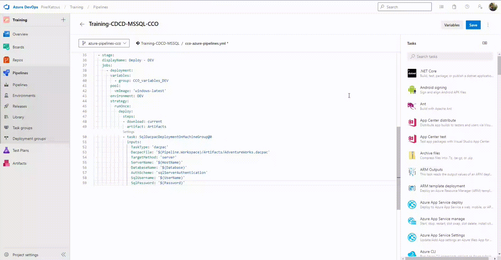
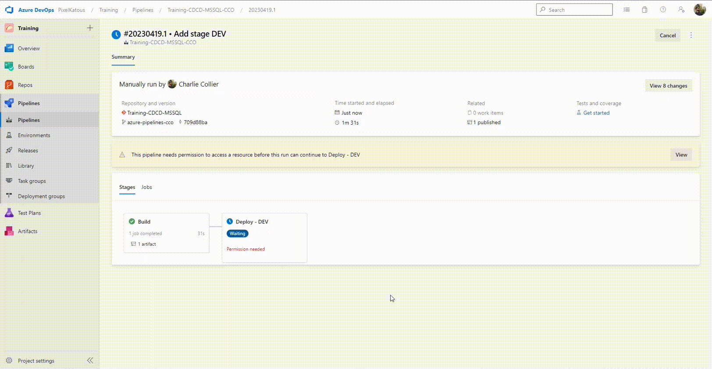

# Exercise 4: Create your first deploy step
The final code is available on the end of the exercise.

## 1. Check current database
1. Connect to SQL Server With Azure Data Studio or SSMS to the server _training-cicd-analytics-dev.database.windows.net_
2. Check the database _training-cicd-analytics-{trigram}-dev_
3. The database must be empty

## 2. Add deploy code skeleton
In the previous created pipeline, after the _build_ stage add a new stage _Deploy - DEV_.

This stage will contains several steps of deploy.

```yaml
  - stage: 
    displayName: Deploy - DEV
    jobs:
      - deployment:
        pool:
          vmImage: 'windows-latest'
        environment: DEV
        strategy:
          runOnce:
            deploy:
              steps:
```

## 3. Add link to variable group
To link the pipeline to the variable group, add the following block before the _pool_ 
```yaml
        variables:
          - group: {Trigram}_variables_DEV
```
## 4. Add deploy steps

### 1. Artifact download
Add the following block as first step to get the previous publish artifact.
```yaml
              - download: current
                artifact: Artifacts
```
### 1. Dacpac deployment
Add the following block as second step to deploy the dacpac from the downloaded artifacts.

| Name          | Value                       | Comment                                      |
| --------------|----------------------------------------------------------:| ---------------------------------------------:|
| DacpacFile    | $(Pipeline.Workspace)/Artifacts/AdventureWorks.dacpac     | Path to the dacpac file                       |
| TargetMethod  | server                                                    |                                               |
| ServerName    | $(HostName)                                               | Hostname variable from the variable group     |
| DatabaseName  | $(Database)                                               | Database variable from the variable group     |
| AuthScheme    | sqlServerAuthentication                                   | Type of authentication used                   |  
| SqlUsername   | $(UserName)                                               | UserName variable from the variable group     |
| SqlPassword   | $(Password)                                               | Password variable from the variable group     |

```yaml
              - task: SqlDacpacDeploymentOnMachineGroup@0
                inputs:
                  TaskType: 'dacpac'
                  DacpacFile: '$(Pipeline.Workspace)/Artifacts/AdventureWorks.dacpac'
                  TargetMethod: 'server'
                  ServerName: '$(HostName)'
                  DatabaseName: '$(Database)'
                  AuthScheme: 'sqlServerAuthentication'
                  SqlUsername: '$(UserName)'
                  SqlPassword: '$(Password)'
```

## 5. Final code
```yaml
trigger:
  branches:
    include:
      - master
  paths:
    include:
      - AdventureWorks
stages:
  - stage: 
    displayName: Build
    jobs:
      - job: 
        pool:
          vmImage: 'windows-latest'
        variables:
          solution: 'AdventureWorks.sln'
          buildOutput: 'AdventureWorks/bin/Release'
          buildConfiguration: 'Release'
        steps:
        - task: VSBuild@1
          inputs:
            Solution: '$(solution)'
            Configuration: '$(buildConfiguration)'
        - task: CopyFiles@2
          inputs:
            SourceFolder: '$(buildOutput)'
            Contents: |
              *.dacpac
            TargetFolder: $(Build.ArtifactStagingDirectory)
        - task: PublishBuildArtifacts@1
          inputs:
            PathToPublish: $(Build.ArtifactStagingDirectory)
            ArtifactName: Artifacts
  - stage: 
    displayName: Deploy - DEV
    jobs:
      - deployment:
        variables:
          - group: {Trigram}_variables_DEV
        pool:
          vmImage: 'windows-latest'
        environment: DEV
        strategy:
          runOnce:
            deploy:
              steps:
              - download: current
                artifact: Artifacts
              - task: SqlDacpacDeploymentOnMachineGroup@0
                inputs:
                  TaskType: 'dacpac'
                  DacpacFile: '$(Pipeline.Workspace)/Artifacts/AdventureWorks.dacpac'
                  TargetMethod: 'server'
                  ServerName: '$(HostName)'
                  DatabaseName: '$(Database)'
                  AuthScheme: 'sqlServerAuthentication'
                  SqlUsername: '$(UserName)'
                  SqlPassword: '$(Password)'
```

## 6. Execute and test the pipeline
Save and start the pipeline


1. Click on _Save_
2. Add a commit message
3. Click on _Commit directly to the azure-pipelines-{Trigram} branch_
4. Click on _Save_
5. Click on _Run_
6. Keep _azure-pipelines-{Trigram} branch_ branch
7. Click on _Run_
8. Wait the end of the build step

Allow acces to the evironement and aprove the dev deployement step



1. Click on _View_ in the yellow warning
2. Click on _Permit_
3. Click on _Review_
4. Click on _Aprouve_
5. Wait the end of the deployement

## 7. Check the deployment
## 1. Check current database
1. Connect to SQL Server With Azure Data Studio or SSMS to the server _training-cicd-analytics-dev.database.windows.net_
2. Check the database _training-cicd-analytics-{trigram}-dev_
3. The database must have some tables and views