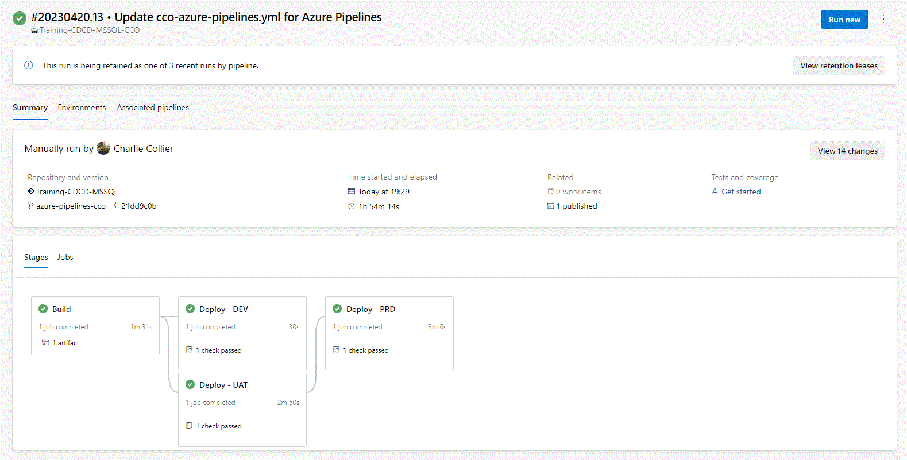

# Exercise 5: Add other stage with dependencies
The final code is available on the end of the exercise.

## 1. Add UAT stage
After the _DEV_ stage, add the following stage
```yaml
  - stage: UAT
    displayName: Deploy - UAT
    dependsOn: Build 
    jobs:
      - deployment:
        variables:
          - group: {Trigram}_variables_UAT
        pool:
          vmImage: 'windows-latest'
        environment: UAT
        strategy:
          runOnce:
            deploy:
              steps:
              - download: current
                artifact: Artifacts
              - task: SqlDacpacDeploymentOnMachineGroup@0
                inputs:
                  TaskType: 'dacpac'
                  DacpacFile: '$(Pipeline.Workspace)/Artifacts/AdventureWorks.dacpac'
                  TargetMethod: 'server'
                  ServerName: '$(HostName)'
                  DatabaseName: '$(Database)'
                  AuthScheme: 'sqlServerAuthentication'
                  SqlUsername: '$(UserName)'
                  SqlPassword: '$(Password)'
```

## 2. Add PRD stage
After the _UAT_ stage, add the following stage.
This stage have a dependency with _UAT_

```yaml
  - stage: PRD
    displayName: Deploy - PRD
    dependsOn: UAT 
    jobs:
      - deployment:
        variables:
          - group: {Trigram}_variables_PRD
        pool:
          vmImage: 'windows-latest'
        environment: PRD
        strategy:
          runOnce:
            deploy:
              steps:
              - download: current
                artifact: Artifacts
              - task: SqlDacpacDeploymentOnMachineGroup@0
                inputs:
                  TaskType: 'dacpac'
                  DacpacFile: '$(Pipeline.Workspace)/Artifacts/AdventureWorks.dacpac'
                  TargetMethod: 'server'
                  ServerName: '$(HostName)'
                  DatabaseName: '$(Database)'
                  AuthScheme: 'sqlServerAuthentication'
                  SqlUsername: '$(UserName)'
                  SqlPassword: '$(Password)'
```

## 3. Intermediate code
```yaml
trigger:
  branches:
    include:
      - master
      - develop
  paths:
    include:
      - AdventureWorks

stages:
  - stage: Build
    displayName: Build
    jobs:
      - job: 
        pool:
          vmImage: 'windows-latest'
        variables:
          solution: 'AdventureWorks.sln'
          buildOutput: 'AdventureWorks/bin/Release'
          buildConfiguration: 'Release'
        steps:
        - task: VSBuild@1
          inputs:
            Solution: '$(solution)'
            Configuration: '$(buildConfiguration)'
        - task: CopyFiles@2
          inputs:
            SourceFolder: '$(buildOutput)'
            Contents: |
              *.dacpac
            TargetFolder: $(Build.ArtifactStagingDirectory)
        - task: PublishBuildArtifacts@1
          inputs:
            PathToPublish: $(Build.ArtifactStagingDirectory)
            ArtifactName: Artifacts
  - stage: DEV
    displayName: Deploy - DEV
    dependsOn: Build 
    jobs:
      - deployment:
        variables:
          - group: {Trigram}_variables_DEV
        pool:
          vmImage: 'windows-latest'
        environment: DEV
        strategy:
          runOnce:
            deploy:
              steps:
              - download: current
                artifact: Artifacts
              - task: SqlDacpacDeploymentOnMachineGroup@0
                inputs:
                  TaskType: 'dacpac'
                  DacpacFile: '$(Pipeline.Workspace)/Artifacts/AdventureWorks.dacpac'
                  TargetMethod: 'server'
                  ServerName: '$(HostName)'
                  DatabaseName: '$(Database)'
                  AuthScheme: 'sqlServerAuthentication'
                  SqlUsername: '$(UserName)'
                  SqlPassword: '$(Password)'
  - stage: UAT
    displayName: Deploy - UAT
    dependsOn: Build 
    jobs:
      - deployment:
        variables:
          - group: {Trigram}_variables_UAT
        pool:
          vmImage: 'windows-latest'
        environment: UAT
        strategy:
          runOnce:
            deploy:
              steps:
              - download: current
                artifact: Artifacts
              - task: SqlDacpacDeploymentOnMachineGroup@0
                inputs:
                  TaskType: 'dacpac'
                  DacpacFile: '$(Pipeline.Workspace)/Artifacts/AdventureWorks.dacpac'
                  TargetMethod: 'server'
                  ServerName: '$(HostName)'
                  DatabaseName: '$(Database)'
                  AuthScheme: 'sqlServerAuthentication'
                  SqlUsername: '$(UserName)'
                  SqlPassword: '$(Password)'
  - stage: PRD
    displayName: Deploy - PRD
    dependsOn: UAT 
    jobs:
      - deployment:
        variables:
          - group: {Trigram}_variables_PRD
        pool:
          vmImage: 'windows-latest'
        environment: PRD
        strategy:
          runOnce:
            deploy:
              steps:
              - download: current
                artifact: Artifacts
              - task: SqlDacpacDeploymentOnMachineGroup@0
                inputs:
                  TaskType: 'dacpac'
                  DacpacFile: '$(Pipeline.Workspace)/Artifacts/AdventureWorks.dacpac'
                  TargetMethod: 'server'
                  ServerName: '$(HostName)'
                  DatabaseName: '$(Database)'
                  AuthScheme: 'sqlServerAuthentication'
                  SqlUsername: '$(UserName)'
                  SqlPassword: '$(Password)'

```
## 4. Test the code
### 1. Run the pipeline



1. Save the code 
2. Run the pipeline
3. Allow to use the evironement when asked

### 2. Check the deployment in UAT
1. Connect to SQL Server With Azure Data Studio or SSMS to the server _training-cicd-analytics-uat.database.windows.net_
2. Check the database _training-cicd-analytics-{trigram}-uat_
3. The database must have some tables and views

### 2. Check the deployment in PRD
1. Connect to SQL Server With Azure Data Studio or SSMS to the server _training-cicd-analytics-prd.database.windows.net_
2. Check the database _training-cicd-analytics-{trigram}-prd_
3. The database must have some tables and views

## 5. Add branch filter
### 1. To DEV stage
On _DEV_ stage add a conditon to allow only _develop_ branch after displayName
```yaml
    condition: eq(variables['Build.SourceBranch'], 'refs/heads/develop')
```

### 1. To UAT & PRD stage
On _UAT_ and _PRD_ stages add a conditon to allow only _master_ branch after displayName

```yaml
    condition: eq(variables['Build.SourceBranch'], 'refs/heads/master')
```

## 6. Final code
```yaml
trigger:
  branches:
    include:
      - master
      - develop
  paths:
    include:
      - AdventureWorks

stages:
  - stage: Build
    displayName: Build
    jobs:
      - job: 
        pool:
          vmImage: 'windows-latest'
        variables:
          solution: 'AdventureWorks.sln'
          buildOutput: 'AdventureWorks/bin/Release'
          buildConfiguration: 'Release'
        steps:
        - task: VSBuild@1
          inputs:
            Solution: '$(solution)'
            Configuration: '$(buildConfiguration)'
        - task: CopyFiles@2
          inputs:
            SourceFolder: '$(buildOutput)'
            Contents: |
              *.dacpac
            TargetFolder: $(Build.ArtifactStagingDirectory)
        - task: PublishBuildArtifacts@1
          inputs:
            PathToPublish: $(Build.ArtifactStagingDirectory)
            ArtifactName: Artifacts
  - stage: DEV
    displayName: Deploy - DEV
    condition: eq(variables['Build.SourceBranch'], 'refs/heads/develop')
    dependsOn: Build 
    jobs:
      - deployment:
        variables:
          - group: {Trigram}_variables_DEV
        pool:
          vmImage: 'windows-latest'
        environment: DEV
        strategy:
          runOnce:
            deploy:
              steps:
              - download: current
                artifact: Artifacts
              - task: SqlDacpacDeploymentOnMachineGroup@0
                inputs:
                  TaskType: 'dacpac'
                  DacpacFile: '$(Pipeline.Workspace)/Artifacts/AdventureWorks.dacpac'
                  TargetMethod: 'server'
                  ServerName: '$(HostName)'
                  DatabaseName: '$(Database)'
                  AuthScheme: 'sqlServerAuthentication'
                  SqlUsername: '$(UserName)'
                  SqlPassword: '$(Password)'
  - stage: UAT
    displayName: Deploy - UAT
    condition: eq(variables['Build.SourceBranch'], 'refs/heads/master')
    dependsOn: Build 
    jobs:
      - deployment:
        variables:
          - group: {Trigram}_variables_UAT
        pool:
          vmImage: 'windows-latest'
        environment: UAT
        strategy:
          runOnce:
            deploy:
              steps:
              - download: current
                artifact: Artifacts
              - task: SqlDacpacDeploymentOnMachineGroup@0
                inputs:
                  TaskType: 'dacpac'
                  DacpacFile: '$(Pipeline.Workspace)/Artifacts/AdventureWorks.dacpac'
                  TargetMethod: 'server'
                  ServerName: '$(HostName)'
                  DatabaseName: '$(Database)'
                  AuthScheme: 'sqlServerAuthentication'
                  SqlUsername: '$(UserName)'
                  SqlPassword: '$(Password)'
  - stage: PRD
    displayName: Deploy - PRD
    condition: eq(variables['Build.SourceBranch'], 'refs/heads/master')
    dependsOn: UAT 
    jobs:
      - deployment:
        variables:
          - group: {Trigram}_variables_PRD
        pool:
          vmImage: 'windows-latest'
        environment: PRD
        strategy:
          runOnce:
            deploy:
              steps:
              - download: current
                artifact: Artifacts
              - task: SqlDacpacDeploymentOnMachineGroup@0
                inputs:
                  TaskType: 'dacpac'
                  DacpacFile: '$(Pipeline.Workspace)/Artifacts/AdventureWorks.dacpac'
                  TargetMethod: 'server'
                  ServerName: '$(HostName)'
                  DatabaseName: '$(Database)'
                  AuthScheme: 'sqlServerAuthentication'
                  SqlUsername: '$(UserName)'
                  SqlPassword: '$(Password)'
```

## 7. Test the code
### 1. Merge code into master & develop
1. Save the code
2. Create and complete a pull request from _azure-pipelines-{Trigram}_ to develop
3. Create and complete a pull request from _azure-pipelines-{Trigram}_ to master
### 2. Execute the pipeline from develop


### 3. Execute the pipeline from master